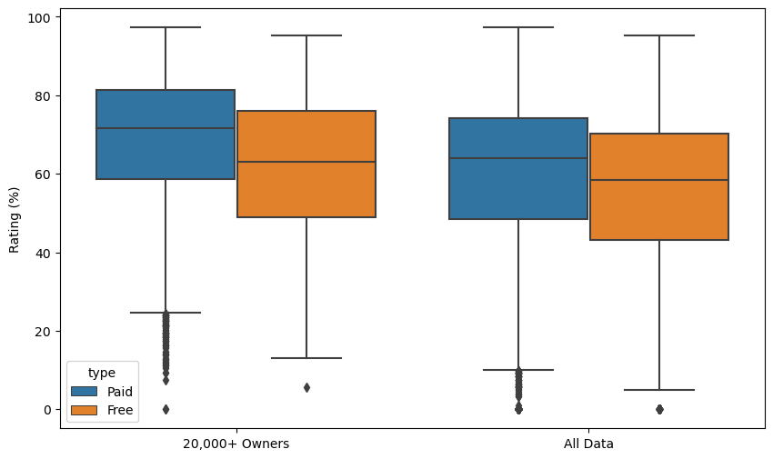
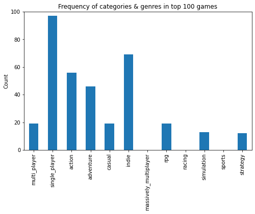
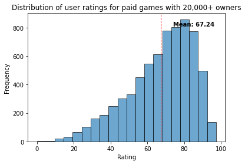
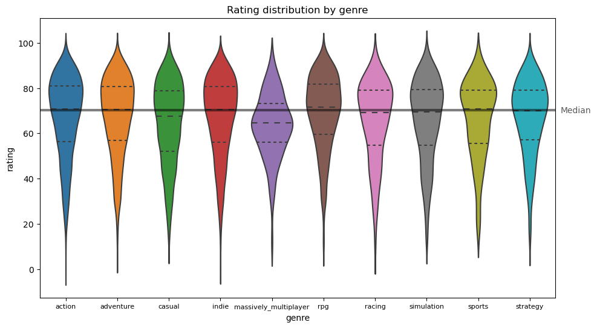
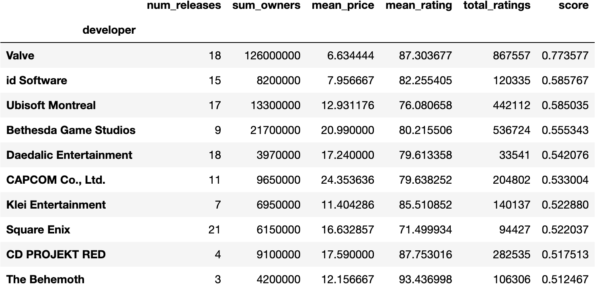

# 05022022_Final_Project

## Overview

The topic for our final project involves analyzing video game trends to better understand what makes them successful upon release.

Our group quickly realized we were assembled based on our passion for video games, so picking our research topic was not so demanding. The Steam platform is the largest digital distribution platform for PC gaming, and is a fantastic resource for examining gaming trends over the last decade. We will imagine that we have been approached by a company that plans to develop and release a new title on Steam's library. Our analyses will function as a valuable asset that may inform decisions regarding the company's budget and timing of release.

## Data References

Our dataset was downloaded from Kaggle in JSON format, and provides us with various information about games offered in the Steam store.

- <https://www.kaggle.com/datasets/trolukovich/steam-games-complete-dataset>

The primary dataset provides some useful columns that we can eventually turn into features for analysis. These include any column's that reference a game's success. This can be measured by critic scores, recommendations, reviews, along with average-play time. There are categories and genres columns that we will need to decide how to use, but they stand out as potential features among the remaining columns.

Some decisions will be decided within the later stages of the project. With the data downloaded, this stage is now complete. In the next step, we'll take care of preparing and cleaning the data, readying a complete data set to use for analysis.

## Analysis

Pandas will be used perform our exploratory analysis. Before we begin to dig into the data, we must preprocess the dataset by transforming it into a format that can be better understood and analyzed for visualizations. The dataset that we download from Kaggle was cleaned prior. The raw metadata was fetched from Steam's API. The data on user ratings, ownership, and playtime is from SteamSpy. We reviewed the script used the clean in hopes of better understanding the dataset, prior to analysis.

The preproccessing script focuses on the following steps:

- Subset to English games only
- Remove games that are not supported by Windows
- Convert `owners` to an integer by splitting each string in column, and keeping the lower-bound
- Calculate `rating` score based on SteamDB method
- Create a new column from `release_date` that represents the year of release
- Encode `categories` and `genres` into separate, binary columns

<details><summary>Click to expand code</summary>
<p>

```python
def remove_non_english(df):

    # keep only rows marked as supporting english
    df = df[df['english'] == 1].copy()
    
    # remove english column, now redundant
    df = df.drop('english', axis=1)
    
    return df

def calc_rating(row):

    # https://steamdb.info/blog/steamdb-rating/

    import math

    pos = row['positive_ratings']
    neg = row['negative_ratings']

    total_reviews = pos + neg
    average = pos / total_reviews
    
    score = average - (average*0.5) * 2**(-math.log10(total_reviews + 1))

    return score * 100

def process_cat_gen_tag(df):
    
    # only going to use these categories
    cat_cols = [
        # 'Local Multi-Player',
        # 'MMO',
        # 'Mods',
        'Multi-player',
        # 'Online Co-op',
        # 'Online Multi-Player',
        'Single-player'
    ]
    
    # create a new column for each category, with 1s indicating membership and 0s for non-members
    for col in sorted(cat_cols):
        col_name = re.sub(r'[\s\-\/]', '_', col.lower())
        col_name = re.sub(r'[()]', '', col_name)
        
        df[col_name] = df['categories'].apply(lambda x: 1 if col in x.split(';') else 0)
        
    # repeat for genre column names
    gen_cols = [
        # 'Accounting',
        'Action',
        'Adventure',
        # 'Animation & Modeling',
        # 'Audio Production',
        'Casual',
        # 'Design & Illustration',
        # 'Documentary',
        # 'Early Access',
        # 'Education',
        # 'Free to Play',
        # 'Game Development',
        # 'Gore',
        'Indie',
        'Massively Multiplayer',
        # 'Nudity',
        # 'Photo Editing',
        'RPG',
        'Racing',
        # 'Sexual Content',
        'Simulation',
        # 'Software Training',
        'Sports',
        'Strategy'
        # 'Tutorial',
        # 'Utilities',
        # 'Video Production',
        # 'Violent',
        # 'Web Publishing'
    ]
    
    gen_col_names = []
    
    # create new columns for each genre with 1s for games of that genre
    for col in sorted(gen_cols):
        col_name = col.lower().replace('&', 'and').replace(' ', '_')
        gen_col_names.append(col_name)
        
        df[col_name] = df['genres'].apply(lambda x: 1 if col in x.split(';') else 0)
        # alternate method using np.where:
        # df[col_name] = np.where(df['genres'].str.contains(col), 1, 0)
    
    # remove "non-games" based on genre
    gen_sums = df[gen_col_names].sum(axis=1)
    df = df[gen_sums > 0].copy()

    # remove redundant columns
    df = df.drop(['categories', 'steamspy_tags'], axis=1)
    
    return df

# preprocess for exploratory analysis
def pre_process():
    
    # read in cleaned dataset
    df = pd.read_csv('Resources/Data/steam_cleaned.csv')
    
    # keep english only
    df = remove_non_english(df)
    
    # keep windows only, and remove platforms column
    df = df[df['platforms'].str.contains('windows')].drop('platforms', axis=1).copy()
    
    # keep lower bound of owners column, as integer
    df['owners'] = df['owners'].str.split('-').apply(lambda x: x[0]).astype(int)
    
    # calculate rating, along w/ simple ratio for comparison
    df['total_ratings'] = df['positive_ratings'] + df['negative_ratings']
    df['rating_ratio'] = df['positive_ratings'] / df['total_ratings']
    df['rating'] = df.apply(calc_rating, axis=1)
    
    # convert release_date to dt type and create separate column for release_year
    df['release_date'] = df['release_date'].astype('datetime64[ns]')
    df['release_year'] = df['release_date'].apply(lambda x: x.year)
    
    # process genres and categories
    df = process_cat_gen_tag(df)
    
    return df

data = pre_process()
```

</details>

#### Compare the average ratings between free & paid games, broken down by owners



<details><summary>Click to expand code</summary>
<p>

```python
fig = plt.figure(figsize=(10,6))

dfa = data[data.owners >= 20000].copy()
dfa['subset'] = '20,000+ Owners'

dfb = data.copy()
dfb['subset'] = 'All Data'

ax = sns.boxplot(x='subset', y='rating', hue='type', data=pd.concat([dfa, dfb]))

ax.set(xlabel='', ylabel='Rating (%)')
plt.show()
```

</p>
</details>

- The average ratings for paid games are significantly lower when taking all the data into account, compared to just looking at the games with 20,000 or more owners.
- The average ratings for paid games are actually lower than the average ratings for free games when looking at all the data, whereas for games with 20,000 or more owners the ratings are noticably higher for paid games.
- Just 8,230 games have more than 20,000 owners, leaving 17,721 with less

#### Number of releases by year, broken down by number of owners


<details><summary>Click to expand code</summary>
<p>

```python
df = data.copy()

years = []
lt_20k = []
gt_20k = []

# very few releases in data prior to 2006, and data is from 2019
for year in sorted(df['release_year'].unique()):
    if year < 2006 or year > 2018:
        continue
    
    # subset dataframe by year
    year_df = df[df.release_year == year]
    
    # calculate total with less than 20,000 owners, and total with 20,000 or more
    total_lt_20k = year_df[year_df.owners < 20000].shape[0]
    total_gt_20k = year_df[year_df.owners >= 20000].shape[0]
    
    years.append(year)
    lt_20k.append(total_lt_20k)
    gt_20k.append(total_gt_20k)
    
owners_df = pd.DataFrame(zip(years, lt_20k, gt_20k), 
                         columns=['year', 'Under 20,000 Owners', '20,000+ Owners'])

ax = owners_df.plot(x='year', y=[1, 2], 
                    kind='bar', 
                    stacked=True, 
                    color=['tab:blue', 'darkgrey']
                   )

ax.set_xlabel('')
ax.set_ylabel('Number of Releases')
ax.set_title('Number of releases by year & number of owners')
sns.despine()
plt.show()
```

</p>
</details>

- Since 2014, the numbers of releases able to attract 20,000+ users has remained fairly steady at ~1,500 releases per year
- The number of releases with fewer than 20,000 owners has seen a huge jump within this same time frame, from ~250 in 2014 to nearly 7,000 by 2018
- Recent releases won't have the same amount of time to generate sales, but still noted
- The trend can likely be partially attributed to the opening on Steam Greenlight in 2012, along with Steam Direct in 2017. Both of these programs made titles even more accessible for consumers, and provided a platform for smaller developers/publishers to release their independent titles.

#### Top 10 highest rated games


<details><summary>Click to expand code</summary>
<p>

```python
display_cols = ['name', 'developer', 'publisher', 'release_year', 'genres', 'average_playtime', 'owners', 'rating', 'price']
top_ten = df.sort_values(by='rating', ascending=False).head(10)
```

</p>
</details>

- 4 of these games are developed and published by Valve
- All of these games have at least 1 million owners
- Mix of older and newer titles

#### The frequency of categories & genres among the highest rated games



<details><summary>Click to expand code</summary>
<p>

```python
# subset top 100 games and most important features
display_cols = ['name', 'developer', 'publisher', 'genres', 'release_year', 'average_playtime', 'owners', 'rating', 'price']
top_hundred = df.sort_values(by='rating', ascending=False).head(100)

# storing category and genre columns back into a variable to easy access
cat_gen_cols = df.columns[-13:-1]
ax = top_hundred[cat_gen_cols].sum().plot.bar(figsize=(8,5))

ax.set_ylim([0, 100])
ax.set_ylabel('Count')
ax.set_title('Frequency of categories & genres in top 100 games')

plt.show()
```

</p>
</details>

- Almost all of them are single player games, and over half are action
- None of the games are MMO, racing or sports
- Unable to draw any conclusions from such a small sample, but we'll note the observations for future reference

#### Distribution of ratings across the data



<details><summary>Click to expand code</summary>
<p>

```python
# paid with over 20,000 owners
df = data[(data.owners >= 20000) & (data.price > 0)].copy()

x = df.rating
result = plt.hist(x, bins=20, color='c', edgecolor='k', alpha=0.65)

# plot line for mean on histogram
plt.axvline(x.mean(), color='k', linestyle='dashed', linewidth=1)

# include mean in text
min_ylim, max_ylim = plt.ylim()
plt.text(x.mean()*1.1, max_ylim*0.9, 'Mean: {:.2f}'.format(x.mean()))
```

</p>
</details>

- The ratings are left-skewed and about half of the ratings are between 60% and 80%
- Hence, games tend to receive more positive ratings than negative ratings

#### Distribution of ratings by genre



<details><summary>Click to expand code</summary>
<p>

```python
g_df = pd.DataFrame()

# create new dataframe with rating and genre, as games can belong to multiple genres
for col in gen_cols:
    ratings = pd.DataFrame(df.loc[df[col] == 1, 'rating'].values, columns=['rating'])
    ratings['genre'] = col
    g_df = pd.concat([g_df, ratings], axis=0)

fig, ax = plt.subplots(figsize=(11,6))
sns.violinplot(x='genre', y='rating', data=g_df, inner='quartile', ax=ax)
ax.axhline(g_df.rating.median(), color='black', lw=3, alpha=.5)
ax.text(9.6, g_df.rating.median()-1, 'median', color='black', alpha=.8)

ax.tick_params(axis='x', labelsize=8)
ax.set_title("Rating distribution by genre");
plt.show()
```

</p>
</details>

- MMO games tend to have much lower ratings than any other genre.
- Casual games have lower ratings than most, and racing and simulation games have slightly lower ratings than most
- RPG games have slightly better ratings than most

### Developers & Publishers

Let's look at the top 10 developers by assigning each one with a score that takes into account a variety of parameters. This provides us with the control to apply weights to certain values, and prioritize those we consider most important.



<details><summary>Click to expand code</summary>
<p>

```python
def get_scores(df):
    # extracting values
    num_releases = df.num_releases**(1/2)
    log_owners = np.log10(df.sum_owners)
    mean_rating = df.mean_rating
    log_ratings = np.log10(df.total_ratings)
    
    # calculating z scores
    z_num_releases = stats.zscore(num_releases)
    z_log_owners = stats.zscore(log_owners)
    z_mean_rating = stats.zscore(mean_rating)
    z_log_ratings = stats.zscore(log_ratings)

    # calculate developer scores
    scores = (.1*z_num_releases + .5*.2*z_log_owners + .5*z_mean_rating + .5*.25*z_log_ratings) / 3
        
    return scores

pv_df = df.copy()
pv_df['num_releases'] = 1
pv = pv_df.pivot_table(index='developer',
                       values=['num_releases', 'owners', 'rating', 'total_ratings', 'price'],
                       aggfunc={'num_releases': np.sum,
                                'owners': np.sum, 
                                'rating': np.mean,
                                'total_ratings': np.sum,
                                'price': np.mean}
                      ).rename({'owners': 'sum_owners', 
                                'price': 'mean_price',
                                'rating': 'mean_rating'}, axis=1)

pv['score'] = get_scores(pv)
pv = pv.sort_values(by='score', ascending=False)
pv.head(10)
```

</p>
</details>

We can repeat the code above to generate the same table for publishers.


### Analysis Summary

- The last five years has seen a huge increase in releases on Steam
- Average rating has been decreasing each year
- MMO games tend to be theworst rated by far
- RPG games tend to be the best rated
- Most games on the Steam store are either Indie or Action
- The more owners of a game, the more ratings it will receive, and the higher that rating is likely to be
- More expensive games tend to receive more ratings, and usually have higher ratings on average
- Valve games are generally well received and sell highly

## Machine Learning

### Scikit-learn(SKlearn) Machine Learning Library

- Scikit-learn(SKlearn) is a robust machine learning library that provides a selection of tools for statistical modeling.
- Features were selected based on whether they could measure a game's sucess or not. Some features we used: ```price```, ```ratings```, ```average play time```, ```release year```, ```genre```, etc. 
- We also created two features to include in the dataset: total_ratings and length_of_time.
- ```total_ratings``` was a calculation we made by finding the average of ```positive_ratings``` and ```negative_ratings``` columns and then totaling those numbers together.
- ```length_of_time``` was a calculation we made by subtracting today's date from the ```release_date``` column. 

<details><summary>Click to expand screenshot</summary>
<p>


</p>
</details>

### SkLearn ```test_and_train()```
- We divided the dataset using SkLearns ```test_and_train()``` method which splits the dataset into four arrays and into two categories called train and test.
- We did an 80/20 split on the dataset. 
- This means that 80% of the data will be trained by the model and 20% of the data will be used to evaluate the fit of our model.
- By calculating the accuracy scores of our train and test sets, we can make some predictions on how the model will behave when new data is passed through.


### Linear Regression Model
- We initially used a Linear Regression model as we thought we could find multiple relationships between our features (i.e. ```price```, ```length_of_time```, ```genre```) or input values and our primary output value ```total_ratings```
- One assumption was that ```total_ratings``` would be much higher on a game that's been out for a longer time versus one that has not. 
- Surprisingly, that was not the case, and both training and testing scores were low.
- After trying out different input values, I could not find any real relationships with our output value.

<details><summary>Click to expand code and screenshot</summary>
<p>

```# Import Scikit-Learn library and intiate model
from sklearn.linear_model import LinearRegression
model = LinearRegression()

# Assign variables
X = games_df.iloc[:, -1].values.reshape(-1, 1)
y = games_df.iloc[:, -2].values

# Split the dataset into four arrays and into two categories: train and test
# Did an 80/20 split
from sklearn.model_selection import train_test_split
X_train, X_test, y_train, y_test = train_test_split(X, y, test_size=.20, random_state=42)

# Fit and train the model; print accuracy scores
model.fit(X_train, y_train)
training_score = model.score(X_train, y_train)
testing_score = model.score(X_test, y_test)
print(f"Training Score: {training_score}")
print(f"Testing Score: {testing_score}")
```

</p>
</details>

### Random Forest Model
- Since we could not find a linear relationship with our features, we decided to try out a classification model instead via Random forest.
- It is a type of ensemble learning technique in which multiple decision trees come from the training dataset, and the majority output from them is considered the final output.
- We hoped that a classification model would answer our questions since a linear model could not.
- In the end, the results were pretty weak as the predicted value of the classifier model was just as low as the linear model.

<details><summary>Click to expand code and screenshot</summary>
<p>

```# Split the dataset into four arrays and into two categories: train and test
from sklearn.model_selection import train_test_split
X_train, X_test, y_train, y_test = train_test_split(X, y, test_size =.20, random_state=1)

# Import Scikit-Learn library and utilize RandomForestClassifier
# to make a classifier model
from sklearn.ensemble import RandomForestClassifier
rf_clf = RandomForestClassifier(criterion='entropy')   
rf_clf.fit(X_train,y_train)

# Test accuracy of the model
from sklearn.metrics import accuracy_score,classification_report,confusion_matrix
y_predict = rf_clf.predict(X_test)
accuracy_score(y_test,y_predict)
```


</p>
</details>


### What we could've done better
- If we had more time, we would continue to refine the model. I think a deep learning model would have gone a long way here. Our dataset is pretty massive, and we only utilized a handful of continuous data.
- Perhaps the question that we're trying to answer is too complex with the tools we're using.

**Other Challenges:**
- To subtract datetime objects, dates must be in a datetime format. The pre-processing script accomplishes this well; however, due to ```release_date``` having mixed timezones, Excel automatically converts those values to just objects or strings.
- It might be worth refactoring the pre-processing function so all date values are converted to a single time zone first so we don't run into this issue in the future.   

## Dashboard

- We'd like our dashboard to be made with Dash, but is subject to change. Our fallback option is Tableau if Dash renders too difficult or time consuming.

- The dashboard will include an array of visualizations along with some text boxes to provide commentary or insights for the visualizations displayed.

- Our dashboard will be structured in an organized way, with the most vital observations up front, and detailed analyses on specific games, developers, or periods of time towards the back, or nested in.

- The dashboard will have filters and dynamic tables that adapt to user input.

## References
```
https://machinelearningknowledge.ai/python-sklearn-random-forest-classifier-tutorial-with-example/
https://machinelearningmastery.com/linear-regression-for-machine-learning/
https://towardsdatascience.com/introduction-to-machine-learning-algorithms-linear-regression-14c4e325882a
https://pynative.com/python-difference-between-two-dates/
https://pandas.pydata.org/pandas-docs/stable/reference/api/pandas.to_datetime.html
https://stackoverflow.com/questions/32490629/getting-todays-date-in-yyyy-mm-dd-in-python
https://pandas.pydata.org/pandas-docs/stable/reference/api/pandas.DatetimeIndex.html#
https://pandas.pydata.org/docs/reference/api/pandas.read_sql_table.html
https://towardsdatascience.com/sqlalchemy-python-tutorial-79a577141a91
https://docs.sqlalchemy.org/en/14/core/engines.html#postgresql
```
